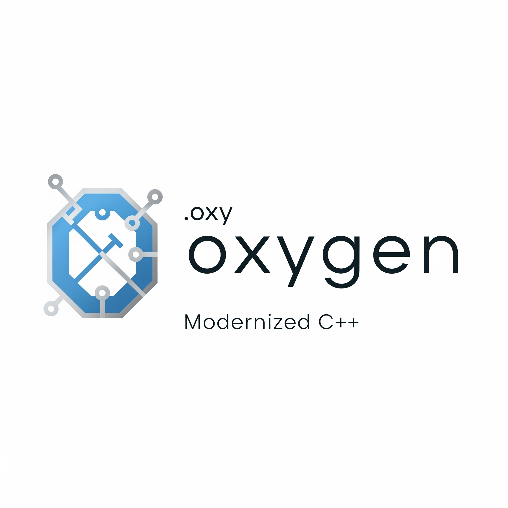

# 🌬️ Oxygen Programming Language
 
[](LICENSE)
[](../../pulls)


*A lightweight scripting language that breathes life into your code.*

---

## 🚀 Introduction

**Oxygen** is an experimental programming language that compiles directly to C++, designed and developed by **Saad Arshad**. Inspired by the versatility of C++, Oxygen aims to make rapid prototyping and learning easier with a modern, minimal syntax.

<div align="center">
  
</div>

---

## ✨ Features

- **Compiles to C++:** Write Oxygen, get C++.
- **Simple Modern Syntax:** Minimal boilerplate, easy to read.
- **Ultra-Low-Level Access:** C++ blocks for ultimate control.
- **Ideal for Learning & Prototyping:** Rapidly test ideas.

---

## 🛠️ Setup & Installation

1. **Clone the Repository**
    ```sh
    git clone https://github.com/Nemesis2917e/Oxygen.git
    cd Oxygen
    ```
2. **Build the Compiler**
    - Follow your platform instructions to build.  
      (A prebuilt `compiler.exe` may be available in the build directory.)

---

## ▶️ Your First Oxygen Script

1. **Create an Oxygen File (`hello.oxy`):**
    ```py
    #include <iostream>
    using namespace std;

    Start() {
        Print "Hello, Oxygen!"
    }
    ```

2. **Transpile to C++:**
    ```sh
    ./compiler.exe hello.oxy output.cpp
    ```

3. **Compile the C++ Output:**
    ```sh
    g++ -o output.exe output.cpp
    ```

4. **Run the Executable:**
    ```sh
    ./output.exe
    ```
    **Output:**  
    ```
    Hello, Oxygen!
    ```

---

## 🧠 Language Overview

| Feature      | Oxygen Syntax                | Output in C++                      |
| ------------ | --------------------------- | ---------------------------------- |
| Entry Point  | `Start() { ... }`           | `int main() { ... }`               |
| Print        | `Print "Hello!"`            | `std::cout << "Hello!" << '\n';`   |
| Comments     | `// this is a comment`      | C++-style comments                 |
| Basic Math   | `Print 4+3 + 50/2 - 5`      | `cout << 4 + 3 + 50/2 -5`          |
| Match        | `match (4 + 2) {`           |   Output : Hello Oxygen            |
|              |`5 => Print "Hello" `        |                                    |
|              |`6 => Print "Hello Oxygen" ` |                                    |
|              |`default => Print "Nothing"}`|                                    |

> More features (variables, control flow, functions) are coming soon!

---

## 🛡️ Code Sample

```cpp
#include <fstream>
#include <iostream>
using namespace std;


@cpp {
//Oxygen is invalid here , C++ only
cout << " Hello , C++ " ;

}


@cpp {
//Oxygen is invalid here , C++ only
cout << " Hello , Cpp block 2 " ;

}

Start() {
     
    Print "\n Oxygen Programming Language \n \n A Modernized Version of C++ \n"
    Print " Currently in Development \n"
    Print "Version 0.5 \n" 
    Print "Created by Saad Arshad \n"
Print 46 + 5 - 1 
Print 60*2 + 2


match (24 + 2) {
    24 => Print "\n Excellent! \n"
    26 => Print "\n Good! \n"
    default => Print "\n   Needs improvement. \n"
}
  

@cpp {
//Oxygen is invalid here , C++ only
cout << "Hello , C++" ;

}


}


```

**Transpiled C++ Output:**
```cpp
#include <fstream>
#include <iostream>
using namespace std;

void oxy_cpp_block_1() {

//Oxygen is invalid here , C++ only
cout << " Hello , C++ " ;


}

void oxy_cpp_block_2() {

//Oxygen is invalid here , C++ only
cout << " Hello , Cpp block 2 " ;


}

void oxy_cpp_block_3() {

//Oxygen is invalid here , C++ only
cout << "Hello , C++" ;


}

int main() {
    oxy_cpp_block_1();
    oxy_cpp_block_2();
    oxy_cpp_block_3();
    cout << "\n Oxygen Programming Language \n \n A Modernized Version of C++ \n" << endl;
    cout << " Currently in Development \n" << endl;
    cout << "Version 0.2 \n" << endl;
    cout << "Created by Saad Arshad \n" << endl;
    cout << (46 + 5 - 1) << endl;
    cout << (60 * 2 + 2) << endl;
    switch (24 + 2) {
        case 24:
    cout << "\n Excellent! \n" << endl;
            break;
        case 26:
    cout << "\n Good! \n" << endl;
            break;
        default:
    cout << "\n   Needs improvement. \n" << endl;
            break;
    }
    return 0;
}
```

---

## 🗺️ Roadmap

- [x] Basic syntax: `Start()`, `Print`, `@cpp` blocks
- [ ] Variables & data types
- [x] Arithmetic expressions
- [ ] If/else, loops
- [ ] Functions & modularization
- [ ] Error handling & diagnostics
- [ ] Linux/macOS support

---

## 🤝 Contributing

We welcome pull requests!  
To contribute:

1. **Fork** the repo  
2. **Create a branch**  
    ```sh
    git checkout -b feature/my-feature
    ```
3. **Make changes & commit**  
    ```sh
    git commit -am "Add feature"
    ```
4. **Push to your fork**  
    ```sh
    git push origin feature/my-feature
    ```
5. **Open a Pull Request**

Please keep your contributions respectful and aligned with the spirit of the project.

---

## 📄 License

Licensed under the [MIT License](LICENSE).

---

## 👨‍💻 Author

**Saad Arshad** — Creator of the Oxygen Programming Language  
> Bringing fresh air to C++ with simplicity and innovation.

---

## 💬 Final Notes

Oxygen is in its early days — but growing fast!  
If you're interested in contributing, testing, or experimenting with new syntax, now's the perfect time to get involved.
